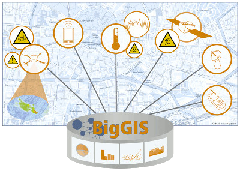

### BigGIS Projekt

Mit BigGIS soll eine neue Generation von GIS entwickelt und erforscht werden,
die mit neuen Mechanismen in vielfältigen Szenarien Entscheidungen auf der Basis
großer Mengen an heterogenen Daten besser und schneller unterstützen.
Die Neuheit liegt besonders in der integrierten Betrachtung von Zeit und Raum
in der Analyse, der Berücksichtigung wesentlich größerer Mengen auch unstrukturierter
und unzuverlässiger Datenmengen, und einer durchgehenden Prozessierungspipeline,
die neben deskriptiven auch prädiktive und präskriptive sowie visuelle Analysen
unterstützt. In den drei Anwendungsfällen „Katastrophenschutz“, „Umwelt“, sowie
„Smart City und Gesundheit“ werden prototypische Problemstellungen adressiert
und Lösungen erarbeitet sowie empirisch validiert und weiterentwickelt.

### Projektziele

Erforschung, Evaluation und Demonstration einer neuen Generation von GIS:

 - Heterogene geo-temporale Daten
 - Integrierte Betrachtung von Zeit und Raum in der Analyse
 - Unstrukturierte und unzuverlässige Datenmengen
 - Durchgehende Prozessierungspipeline für prädiktive, präskriptive und visuelle Analyse

### Szenarien

 - Smart City und Gesundheit (Urban Heat Islands, Feinstaub)
 - Umweltmanagement (Gesundheitsgefährdende Tiere / Pflanzen)
 - Katastrophenschutz (Luft / Giftgas)
